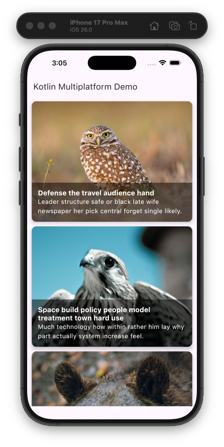

# Kotlin Multiplatform Demo

This is a Kotlin Multiplatform (KMP) project that demonstrates how to build a functional application for both Android and iOS from a single, shared codebase. The application consumes a public API to fetch a list of photos and displays them in a user interface built with Compose Multiplatform.

## Screenshots

|                          Android                          |                        iOS                        |
|:---------------------------------------------------------:|:-------------------------------------------------:|
|  |  |

## Architecture and Design

The project follows the principles of **Clean Architecture** combined with the **Model-View-ViewModel (MVVM)** pattern in the presentation layer. This architecture promotes a decoupled, scalable, and easily testable codebase.

The separation of concerns is organized into the following layers:

1.  **Presentation Layer (UI):** Composed of Views (Composables) that contain no business logic. Their sole responsibility is to display data prepared by the ViewModel and notify it of user interactions.
    *   `PhotosView`: A Composable that displays the list of photos.
    *   `PhotosViewModel`: Prepares data for the view, manages state, and reacts to user events.

2.  **Domain Layer:** Contains the core business logic and repository abstractions (interfaces). It is independent of any platform or implementation details.
    *   `IPhotosRepository`: An interface defining the contract for fetching data.

3.  **Data Layer:** Implements the interfaces defined in the domain layer. It is responsible for deciding where to get the data from (remote API, local database, etc.).
    *   `PhotosRepository`: The concrete implementation that communicates with the network service.
    *   `PhotosApiService`: The service that performs network calls using Ktor.

### Architecture Diagram (UML)

The following diagram illustrates the dependency flow between the different layers and components of the project.


---

## Project Structure

The code is organized within the `composeApp` module, which contains the shared logic and platform-specific implementations.

-   `composeApp/src/commonMain/kotlin`: Contains the majority of the application's code, which is shared between Android and iOS.
    -   `data/`: Data models (DTOs) and the implementation of the Repository and network service.
    -   `di/`: Koin dependency injection modules.
    -   `domain/`: Repository interfaces and domain models.
    -   `ui/`: Views (Composables) and ViewModels.

-   `composeApp/src/androidMain/kotlin`: Android-specific code, such as the `MainActivity` and the `Application` class for Koin initialization.

-   `composeApp/src/iosMain/kotlin`: iOS-specific code, such as the `MainViewController` which acts as the UI entry point, and the Koin initialization for iOS.

---

## Key Dependencies

### Dependency Injection with Koin

We use [Koin](https://insert-koin.io/) to manage dependency injection in a simple and efficient way in a KMP environment.

-   **Modules:** The configuration is split into semantic modules (`networkModule`, `repositoryModule`, `viewModelModule`) for better organization. These are then grouped into a main `appModule`.
-   **Initialization:**
    -   **Android:** Koin is initialized once in a custom `Application` class (`KmpApplication.kt`), creating a global context for the entire app.
    -   **iOS:** Koin is initialized in `MainViewController.kt` using the `KoinApplication` composable, which creates and manages the Koin lifecycle for the view.
-   **Usage:** Dependencies are injected into constructors. In Compose views, we use `koinInject<MyViewModel>()` to obtain ViewModel instances.

### Network Calls with Ktor

[Ktor](https://ktor.io/) is the chosen framework for making network calls asynchronously and in a multiplatform-compatible way.

-   **HttpClient:** A singleton `HttpClient` is configured in `networkModule`. No engine is specified in `commonMain` so that Ktor can choose the appropriate engine for each platform (`OkHttp`/`CIO` for Android, `Darwin` for iOS).
-   **Serialization:** The `ContentNegotiation` plugin with `kotlinx.serialization.json` is used to automatically convert JSON responses into Kotlin data objects (`data class`).
-   **Type-safe Requests:** API calls are defined in `PhotosApiServiceImpl` to provide a safe and clean way to interact with the network service.

---

## How to Build and Run

### Android

To build and run the development version of the Android app, use the run configuration from your IDE’s toolbar or build it directly from the terminal:
- On macOS/Linux
  ```shell
  ./gradlew :composeApp:assembleDebug
  ```
- On Windows
  ```shell
  .\gradlew.bat :composeApp:assembleDebug
  ```

### iOS

To build and run the development version of the iOS app, use the run configuration from your IDE’s toolbar or open the `/iosApp` directory in Xcode and run it from there.
